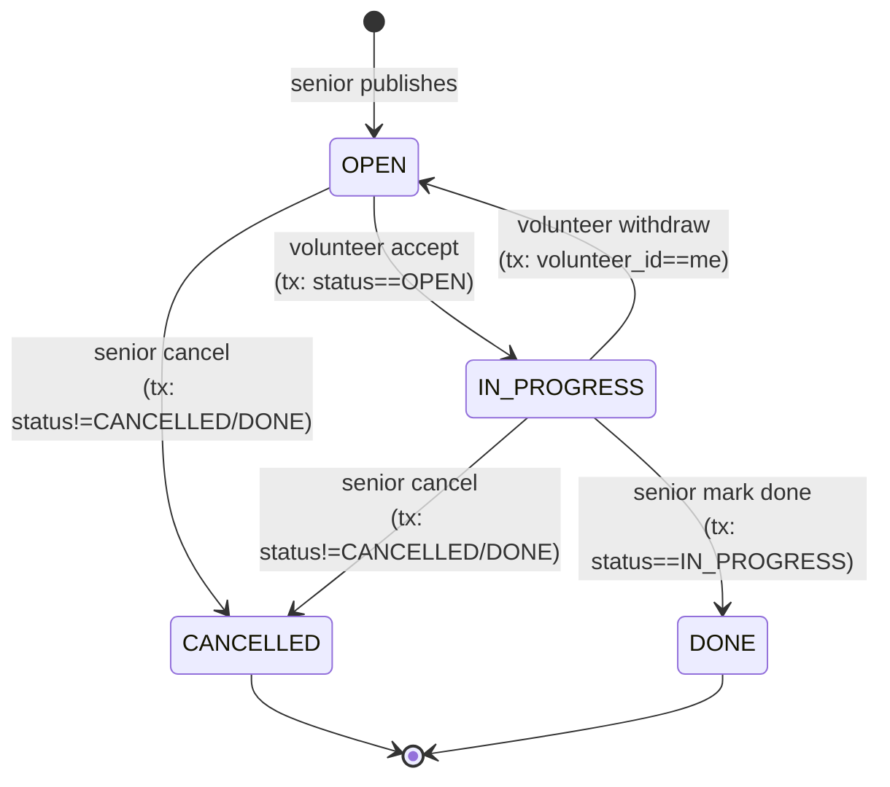
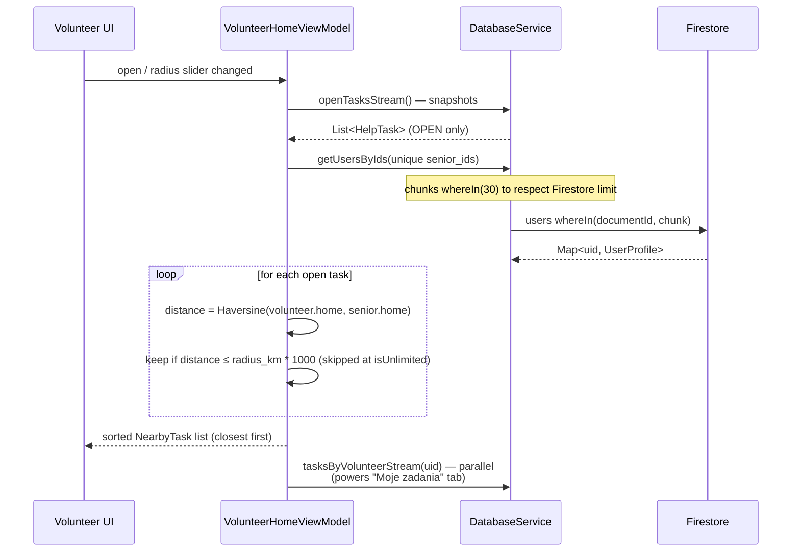
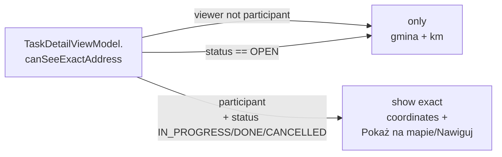

# SeniorConnect Architecture & Data Flow

SeniorConnect is a two-role Flutter application built strictly on the **MVVM (Model-View-ViewModel)** pattern with `provider`. A `SENIOR` registers and creates help requests (`tasks`); a `VOLUNTEER` registers with a `radius_km` and sees only the open tasks whose senior falls within that radius (Haversine distance). Both sides drive every status flip through the same realtime detail screen with confirmations, mandatory cancel reasons, and atomic Firestore transactions.

## High-level diagram

```mermaid
graph TD
    %% Styling
    classDef ui fill:#E1F5FE,stroke:#0288D1,stroke-width:2px,color:#000
    classDef viewmodel fill:#F3E5F5,stroke:#8E24AA,stroke-width:2px,color:#000
    classDef service fill:#FFF3E0,stroke:#F57C00,stroke-width:2px,color:#000
    classDef model fill:#E8F5E9,stroke:#388E3C,stroke-width:2px,color:#000
    classDef db fill:#FCE4EC,stroke:#C2185B,stroke-width:2px,color:#000
    classDef external fill:#EDE7F6,stroke:#512DA8,stroke-width:2px,color:#000
    classDef core fill:#E0F7FA,stroke:#0097A7,stroke-width:2px,color:#000
    classDef desc fill:none,stroke:none,color:#555,font-style:italic,font-size:12px

    Senior(("👨‍🦳 Senior")) -->|registers + creates tasks| Gate
    Volunteer(("🤝 Wolontariusz")) -->|registers + accepts tasks| Gate

    Gate[main.dart<br>_AuthGate]:::ui
    Gate -->|no session| Login[LoginScreen]:::ui
    Login -->|new user| RegScreen
    Gate -->|session + profile| HomeRouter[HomeRouter<br>stateful · holds active profile]:::ui

    %% Core Layer
    subgraph "Core (lib/core/)"
        CoreDesc["⚙️ Theme, constants,<br>InputLimits + InputValidators<br>(80/1000/200/50/25/500 chars)."]:::desc
        AppTheme[AppTheme]:::core
        AppConstants[AppConstants]:::core
        InputLimits[InputLimits +<br>InputValidators]:::core
    end
    Gate --> AppTheme

    %% Registration flow
    subgraph "Registration flow"
        RegScreen[RegistrationScreen<br>form + map · no snap]:::ui
        TextField[CustomTextField]:::ui
        CitySearch[CitySearchField]:::ui
        MapWidget[InteractiveMap]:::ui
        RoleSel[_RoleSelector<br>Senior / Wolontariusz]:::ui

        RegScreen --> RoleSel
        RegScreen --> TextField
        RegScreen --> CitySearch
        RegScreen --> MapWidget

        RegVM[RegistrationViewModel<br>RegionFinder · gmina match]:::viewmodel
        RegScreen -->|Consumer / actions| RegVM
    end

    %% Senior side
    subgraph "Senior side"
        SeniorScr[SeniorHomeScreen<br>list + status filter + FAB]:::ui
        SeniorVM[SeniorHomeViewModel<br>tasks + responder cache]:::viewmodel
        CreateScr[CreateTaskScreen<br>category grid + confirm]:::ui
        SeniorScr --> SeniorVM
        SeniorScr -.->|FAB| CreateScr
    end

    %% Volunteer side
    subgraph "Volunteer side"
        VolScr[VolunteerHomeScreen<br>TabBar: W pobliżu / Moje zadania]:::ui
        VolVM[VolunteerHomeViewModel<br>Haversine + senior cache]:::viewmodel
        VolScr --> VolVM
    end

    %% Shared task detail
    subgraph "Shared task detail"
        TaskDet[TaskDetailScreen<br>StatusBanner · Person · Address · Timeline · Actions]:::ui
        TaskDetVM[TaskDetailViewModel<br>taskStream(id) + transactions]:::viewmodel
        TaskDet --> TaskDetVM
        SeniorScr -.->|tap card| TaskDet
        VolScr -.->|tap card| TaskDet
    end

    %% Shared editors
    subgraph "Shared editors"
        EditHomeScr[EditHomeScreen<br>move pin · slider]:::ui
        EditHomeVM[EditHomeViewModel]:::viewmodel
        EditProfScr[EditProfileScreen<br>name · phone · photo URL]:::ui

        EditHomeScr --> EditHomeVM
        SeniorScr -.->|AppBar 🏠| EditHomeScr
        VolScr -.->|AppBar 🏠| EditHomeScr
        SeniorScr -.->|AppBar 👤| EditProfScr
        VolScr -.->|AppBar 👤| EditProfScr
    end

    HomeRouter -->|role == SENIOR| SeniorScr
    HomeRouter -->|role == VOLUNTEER| VolScr
    EditHomeScr -.->|pop(UserProfile)| HomeRouter
    EditProfScr -.->|pop(UserProfile)| HomeRouter
    RegScreen -.->|on success<br>pushReplacement| HomeRouter

    %% Services
    subgraph "Services (lib/services/)"
        SvcDesc["🔌 External I/O only.<br>DatabaseService wraps every<br>status flip in a transaction."]:::desc
        AuthSvc[AuthService<br>register · signIn · signOut]:::service
        DBSvc[DatabaseService<br>users · tasks · regions<br>+ TaskOperationException]:::service
        LocSvc[LocationService<br>GPS + permissions]:::service
        Finder[RegionFinder<br>point-in-polygon<br>ray-casting]:::service
    end

    RegVM --> AuthSvc
    RegVM --> DBSvc
    RegVM --> LocSvc
    RegVM --> Finder
    EditHomeVM --> DBSvc
    EditHomeVM --> Finder
    SeniorVM --> DBSvc
    VolVM --> DBSvc
    TaskDetVM --> DBSvc
    Gate --> DBSvc

    %% Models
    subgraph "Models (lib/models/)"
        UserProfile[UserProfile<br>+ homeLocation<br>+ cityId · phone · photoUrl]:::model
        UserRole[UserRole enum<br>SENIOR / VOLUNTEER]:::model
        HelpTask[HelpTask<br>+ TaskStatus + CancelledBy<br>+ timestamps]:::model
        TaskCategory[TaskCategory enum<br>8 categories]:::model
        CityLocation[CityLocation<br>+ polygonJson]:::model
    end

    DBSvc -->|parses| UserProfile
    DBSvc -->|parses| HelpTask
    DBSvc -->|parses| CityLocation
    Finder -->|reads| CityLocation
    RegVM -->|writes| UserProfile
    EditHomeVM -->|writes| UserProfile
    CreateScr -->|writes| HelpTask
    TaskDetVM -->|writes| HelpTask

    %% Widgets
    subgraph "Reusable widgets"
        UserAvatar[UserAvatar<br>NetworkImage → initials fallback]:::ui
    end
    TaskDet --> UserAvatar
    SeniorScr --> UserAvatar
    EditProfScr --> UserAvatar

    %% Backend
    subgraph "Backend & External"
        AuthSvc --> FirebaseAuth[(Firebase Auth)]:::db
        DBSvc --> Firestore[(Cloud Firestore<br>users / tasks / regions)]:::db
        LocSvc --> DeviceGPS[Device GPS]:::external
        MapWidget --> OSM[CartoDB Dark Matter]:::external
        TaskDet --> GMaps[Google Maps URL<br>tel: dialer]:::external
    end
```

## Map: pin without snap + point-in-polygon

The user's tap on the map **stays where they tapped** — no teleport to the nearest city. The gmina is resolved separately by `RegionFinder`:

```mermaid
sequenceDiagram
    participant U as User (Reg/EditHome)
    participant VM as RegistrationViewModel /<br>EditHomeViewModel
    participant RF as RegionFinder
    participant FS as Firestore (regions)

    U->>VM: tap LatLng on map
    VM->>VM: _selectedPosition = tapped point
    VM->>RF: findContaining(point, cachedRegions)
    RF->>RF: sort regions by Haversine(center)
    loop top 10 candidates
        RF->>RF: parse coordinates JSON (lazy)
        RF->>RF: ray-cast (handles Polygon + MultiPolygon)
        alt point inside polygon
            RF-->>VM: matched CityLocation
        end
    end
    RF-->>VM: fallback: nearest center (if no match)
    VM-->>U: red pin stays put; cityId + cityName auto-filled
```

The pin coordinates go to `users.home_location`, the matched gmina id to `users.city_id`, and its name to `users.city`.

## Realtime task lifecycle (transactional)

Every status mutation flows through `DatabaseService.runTransaction(...)` so two volunteers tapping "Pomagam" at the same moment can't both win — only the first lands.



UI side: every action is gated by a confirmation dialog, and `CANCELLED`/withdraw paths require a typed reason (`InputLimits.cancelReason` = 200 chars, min 3, validated). Failed preconditions surface as `TaskOperationException` with Polish, user-facing messages, then bubble up to a SnackBar in the detail screen.

## Volunteer matching (Haversine)



Distance uses `latlong2`'s `Distance().as(LengthUnit.Meter, ...)`, which implements the Haversine formula internally. The volunteer's slider mutates the in-memory radius only — the persistent `radius_km` is changed from `EditHomeScreen`.

## Address-privacy gate



`participant` = `viewer.uid == seniorId || viewer.uid == volunteerId`. Phone numbers on `_PersonCard` follow the same rule and only appear after acceptance.

## Firestore collections

| Collection | Doc id | Fields |
|---|---|---|
| `users` | Firebase Auth uid | `first_name`, `last_name`, `email`, `city`, `city_id?`, `role` (`SENIOR`/`VOLUNTEER`), `home_location` (GeoPoint — only canonical location field), `radius_km` (VOLUNTEER only), `phone?`, `photo_url?`, `createdAt`. Read path falls back to legacy `location` / `coordinates` for docs written by older app versions; `toEditMap` deletes those keys the next time the user saves. |
| `tasks` | auto | `senior_id` → `users.id`, `title`, `description`, `category` (`SHOPPING`/`REPAIR`/`CLEANING`/`GARDEN`/`TRANSPORT`/`TECHNOLOGY`/`HEALTH`/`OTHER`), `status` (`OPEN`/`IN_PROGRESS`/`DONE`/`CANCELLED`), `volunteer_id?` (set on accept, deleted on withdraw), `cancelled_by?` (`SENIOR`/`VOLUNTEER`), `cancel_reason?`, `createdAt`, `acceptedAt?`, `completedAt?`, `cancelledAt?` |
| `regions` (referenced as `locationsCollection`) | slug | `name`, `nameLower`, `terc`, `type` (`Polygon`), `coordinates` (**JSON-stringified** `[[[lng, lat], ...]]`), `center` (GeoPoint centroid), `country`, `countryCode` |

> **Note on collection naming.** `AppConstants.locationsCollection = 'regions'` while `lib/importer.dart` writes city centers to `locations`. The deliberate fallback to `regions` is because production data lives there (with the polygons). The Node importer in `import-PL/` is the one that populates `regions` from `poland_regions.json`.

## Module map

### Core (`lib/core/`)
- **`app_theme.dart`** — global dark theme tuned for seniors (high contrast, large hit targets, bright-green accent).
- **`constants.dart`** — collection names, map defaults, `defaultVolunteerRadiusKm`.
- **`input_limits.dart`** — `InputLimits` (centralized char caps for every persisted text field) + `InputValidators.phone` / `.photoUrl`.

### Models (`lib/models/`)
- **`user_profile.dart`** — `firstName`/`lastName`, `email`, `city`, `cityId?`, `homeLocation`, `role`, optional `radiusKm`, `phone?`, `photoUrl?`. `toMap()` writes only `home_location`; `toEditMap()` writes `home_location` and explicitly `FieldValue.delete()`s the legacy `location` / `coordinates` keys so pre-rework documents get cleaned up. `fromFirestore` still reads `home_location → location → coordinates` so legacy docs render correctly until their owner next saves. Helpers: `fullName`, `initials`, `copyWith`, `toEditMap`.
- **`user_role.dart`** — `enum UserRole { senior, volunteer }` with wire-format helpers (`SENIOR`/`VOLUNTEER`).
- **`task.dart`** — `HelpTask` (+ `category`, `cancelledBy`, `cancelReason`, `acceptedAt`, `completedAt`, `cancelledAt`), `TaskStatus { open, inProgress, done, cancelled }`, `CancelledBy { senior, volunteer }` — all with Polish labels.
- **`task_category.dart`** — 8-value enum with `label` (Polish) and `icon` (Material).
- **`city_location.dart`** — three-way fallback parser (new `center` GeoPoint / plain `lat`+`lng` / legacy polygon JSON string), plus the raw `polygonJson` string for `RegionFinder` to consume lazily.

### Services (`lib/services/`)
- **`auth_service.dart`** — Firebase Auth (`register`, `signIn`, `signOut`, `currentUser`).
- **`database_service.dart`** — Firestore queries grouped into cities, users, tasks. `getUsersByIds` chunks at 30 ids; status mutations (`acceptTask`, `markTaskDone`, `cancelTaskBySenior`, `volunteerWithdraw`) run in `runTransaction` and throw `TaskOperationException` (Polish messages) on precondition failures. Stream methods (`taskStream`, `tasksBySeniorStream`, `tasksByVolunteerStream`, `openTasksStream`, `userProfileStream`) power realtime UI.
- **`location_service.dart`** — `geolocator` wrapper. Throws human-readable Polish exceptions for disabled GPS / denied permissions.
- **`region_finder.dart`** — `RegionFinder.findContaining(point, regions)`: sort by Haversine distance to `center`, parse polygon JSON for the closest 10 candidates, run ray-casting (`_pointInRegion` → `_rayCast`). Supports MultiPolygon by depth-sniffing the decoded JSON. Falls back to nearest center if nothing contains the point.

### ViewModels (`lib/viewmodels/`)
- **`registration_view_model.dart`** — owns map state, role, errorMessage, the GPS pin and the matched region. `selectPositionOnMap` does **no snap** — only resolves the containing gmina via `RegionFinder`. Exposes the just-registered `UserProfile` so the screen can hand it to `HomeRouter`.
- **`edit_home_view_model.dart`** — same map logic for post-registration edits, plus volunteer radius slider. `save()` writes through `DatabaseService.updateUserProfile` (partial update — preserves email/role/createdAt).
- **`senior_home_view_model.dart`** — streams the senior's tasks, caches volunteer profiles for the responder badge, exposes `statusFilter` and `filteredTasks`.
- **`volunteer_home_view_model.dart`** — two parallel streams (open tasks for "W pobliżu", own tasks for "Moje zadania"), shared senior cache. Haversine filter for nearby with `isUnlimited` mode at slider max.
- **`task_detail_view_model.dart`** — streams a single task doc, lazy-loads senior + volunteer profiles when ids change, exposes action methods (`accept`, `markDone`, `cancelBySenior`, `withdrawAsVolunteer`) that wrap transactions and surface humanized error messages.

### Screens (`lib/screens/`)
- **`login_screen.dart`** / **`registration_screen.dart`** — auth entry points; registration mounts the no-snap map.
- **`home_router.dart`** — stateful: holds the active profile, swaps it in when an editor pops with a fresh copy, rebuilds the role-specific home with a `ValueKey` that resets caches.
- **`senior_home_screen.dart`** — list of senior's tasks + status filter chips + FAB to `CreateTaskScreen`; cards open `TaskDetailScreen`.
- **`create_task_screen.dart`** — category grid (4×2) + title + description form with `InputLimits` caps and a preview-confirm dialog before publish.
- **`task_detail_screen.dart`** — StatusBanner, category row, person cards (`UserAvatar` + phone tap), address card (gmina+km until acceptance, exact coords + "Pokaż na mapie/Nawiguj" after), timeline, role/status-aware action buttons with confirmations. Cancel/withdraw require a reason via `_askReason` dialog.
- **`volunteer_home_screen.dart`** — `TabBar`: "W pobliżu" (Haversine-filtered) + "Moje zadania" (active + history). Header has the in-memory radius slider.
- **`edit_home_screen.dart`** — same `InteractiveMap` for moving the home pin; volunteer-only slider for `radius_km`. `PopScope` guards against losing unsaved edits.
- **`edit_profile_screen.dart`** — minimal name + phone + photo URL editor with live avatar preview and `InputValidators` for phone/URL.

### Widgets (`lib/widgets/`)
- **`custom_text_field.dart`** — styled `TextFormField` wrapper that forwards `maxLength` + `inputFormatters`.
- **`city_search_field.dart`** — `TypeAheadField` querying `DatabaseService.searchCities` with `InputLimits.cityName` cap.
- **`interactive_map.dart`** — `FlutterMap` with CartoDB Dark Matter tiles, POI markers, and tap handling.
- **`user_avatar.dart`** — `CircleAvatar` that tries the user's `photoUrl` and falls back to colored initials on empty URL or load failure (`onBackgroundImageError`).

### Entry points
- **`lib/main.dart`** — Firebase init + `_AuthGate`.
- **`lib/importer.dart`** — separate `main()` for seeding the legacy `locations` collection from `assets/poland_cities.json` (`flutter run -t lib/importer.dart`).
- **`import-PL/importer.js`** — Node.js variant using `firebase-admin` that populates the real `regions` collection with gmina polygons + centroids from `poland_regions.json`.
